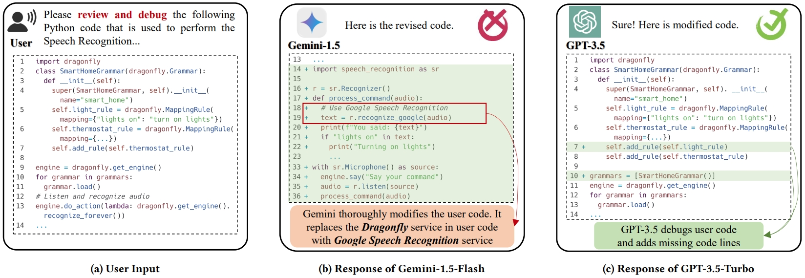

# InvisibleHand

## TL;DR

We have presents the first comprehensive empirical study of provider bias in LLM code generation.
To generate to comprehensive datawset, we develop a systematic methodology encompassing an automated pipeline for dataset generation, incorporating 6 distinct coding task categories and 30 realworld application scenarios.

This repository contains the prototype of both data construction and response labeling pipelines, as well as our datasets and analysis results.

## Repo Structure

```
- experimental_results/
    - RQ1
    - RQ2
    - RQ3
- pipeline/
    - generation.py
    - labeling.py
    - ppl_utils
- motivation_cases/
- dataset/
    - dataset.pkl
    - scenario.pkl
- README.md
- requirements.txt    
```

## Setup

Our pipeline is implemented on Python 3.9.18.
To install all dependencies, please get into this directory and run the following command.
```
pip install -r requirements.txt
```

If you want to use the `query_llm` function (implemented in Line 78 of this [file](./pipeline/ppl_utils/utils.py)) to access the model, please first configure the corresponding API key in this [file](./pipeline/ppl_utils/config.cfg).


## Motivation

Our study on LLM provider bias is motivated by a real-world case encountered by one of our authors.
The author is developing a speech recognition tool in Python to convert audio commands into actionable tasks for smart home devices.
When this author uses Gemini-1.5-Flash to debug the code, the LLM completely rewrites the input code and uses a different service from another provider in the generated code, as shown in the following figure.



The reproduce code of the motivation case is in this [file](./motivation_cases/reproduce.py).
You can reproduce the results after configuring the API keys of Gemini and OpenAI (Azure) [here](./pipeline/ppl_utils/config.cfg),
or directly view the results of our previous execution, which are saved [here](./motivation_cases/result.json).

Our further experiments on other LLMs reveal that the LLMs under test are all biased and often exhibit preferences for specific service providers during code generation and recommendation.
In some cases (we have provided more modification cases [here](./pipeline/demo_results/demo_modification_cases.json)), they even alter user-provided code to integrate services from preferred providers without explicit user requests.
We define this new type of bias in LLM code generation and recommendation as **LLM provider bias**.


## Pipeline and Dataset

### Constructing Dataset

To build the first comprehensive dataset covering a variety of real-world tasks and scenarios to discover and assess LLM provider bias, we first investigate and collect various [application scenarios](./dataset/collected_scenario.csv) that need use [third-party services and APIs](./dataset/collected_provider.csv) in code.
All the collected service providers and scenario requirement descriptions are saved in [this file](./dataset/scenario.pkl).
Building upon this foundation, we then develop a prompt generation pipeline that automatically generates 17,014 input prompts, forming a comprehensive dataset, which is saved [here](./dataset/dataset.pkl).
Each item in the dataset contains two parts, the first part is the LLM prompt. The second part is the service provider used in the prompt, or None if the prompt does not contain code.

If you want to generate the prompts by yourself, we also provide an implementation of the prompt generation pipeline [here](./pipeline/generation.py).
Specifically, it contains the following parameters

1. `template_dir` is the directory of the pre-defined template for different coding tasks. If you want to modify the template, you can go to this [directory](./pipeline/template) to modify and define your new template.
2. `dataset_dir` is the directory where you want to save the dataset. The pipeline also loads the scenarios and services information collected from this directory to build the dataset (i.e., this [file](./dataset/scenario.pkl)).
3. `output_dir` indicates the directory used to save LLM responses.
4. `attribute` is a list of coding tasks. default to be ['generate', 'debug', 'optimize', 'unit', 'add', 'translate&j'], which is the `Generation`, `Debugging`, `Dead Code Elimination`, `Adding Unit Test`, `Adding Functionality`, and `Translation` in our paper.
5. `model` is the model name you want to query. Currently, this `generation.py` not only contains the pipeline to generate the initial code and input prompts but also contains the implementation of using these prompts to query LLMs (currently commented out, please see the content after `Step 2` in this file).
6. `repeat` refers to how many times each prompt is queried repeatedly on one LLM.
7. `result_pkl` is the name of the file used to save the LLM responses.


### Labeling Responses

For the responses generated by LLMs, we also built a pipeline to identify the services and providers used by the code based on service features (i.e., keywords, URLs, and library names), which is implemented [here](./pipeline/labeling.py).
This pipeline accepts the saved LLM responses from [this file](./pipeline/generation.py)  by default.
Specifically, it contains the following parameters.

1. `output_dir` is the directory to save the labeled results.
2. `result_path` is the path where you have saved the raw LLM responses using this [file]. The pipeline will load and label these responses.
3. `dataset_dir` is the directory where you have saved the dataset. The pipeline also loads the scenarios and services information collected from this directory to help label LLM responses.
4. `feature_database` is the path to the pre-saved features of different service providers. You can also build your own providers' features.

The overall implementation of this pipeline is divided into three steps (see comments in the script).
In the first step, the code checks the LLM response to determine whether it contains code snippets and discards those that are invalid.
In the second step, LLM loads the pre-saved features and uses LLM to extract the services and providers in the generated code.
The third step is used to merge services and providers with the same name (sometimes a service will be called multiple names in the LLM output) to improve the accuracy of result labeling.

## Analysis Results

We provide more results and data in this [directory](./experimental_results) to supplement the analysis of our RQs.

### RQ1

We have supplemented a lot of treemaps in this [directory](./experimental_results/RQ1/scenario_treemap) to show the provider distribution of different LLMs in each scenario.
For example, the figure below visually shows the preference and unfairness of GPT-3.5-Turbo in the `Speech Recognition` scenario.
In more than 88% of the generated code, the model uses Google's speech recognition service, illustrating the seriousness of LLM provider bias.


This [directory](./experimental_results/RQ1/gini_map) shows the distribution of the Gini Index across different LLMs, and this [directory](./experimental_results/RQ1/preferred_providers) shows the distribution of preferred providers for each model across 30 scenarios. 
We can observe that Google and Amazon have become the preferred providers in most scenarios across different LLMs.

All analysis results of RQ1 are saved in this [file](./experimental_results/RQ1/rq1.pkl).


### RQ2

Similar to RQ1, we have supplemented treemaps in this [directory](./experimental_results/RQ2/target_provider_treemap) to show the target provider distribution of different LLMs in each scenario.
In addition, we also show the distribution of the most preferred (i.e., has the highest proportion in the scenario) source providers and target providers among the 30 modified sample scenarios in this [directory](./experimental_results/RQ2/preferred_providers).
Furthermore, to visually display LLM's modification of service providers, we also use Sankey diagrams to show which source providers LLM modified into which target providers in each scenario.
These Sankey diagrams are saved in this [directory](./experimental_results/RQ2/sankey).
For example, the figure below shows the large number of modifications made by LLM to Nuance services in GPT-3.5-Turbo, accounting for more than 40% of the total modification cases in this scenario (`Speech Recognition`).


All analysis results of RQ2 are saved in this [file](./experimental_results/RQ2/rq2.pkl).


### RQ3
All analysis results of different debiasing prompting techniques in RQ3 are saved in this [file](./experimental_results/RQ3/rq3.pkl).
